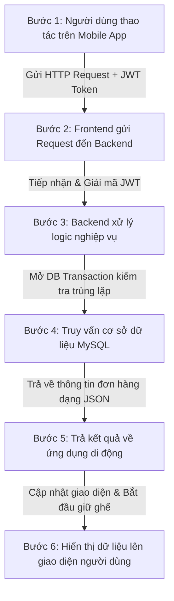

# ⚙️ Quy Trình Hoạt Động Của Hệ Thống - MyCinema

Quy trình hoạt động và luồng xử lý thông tin khép kín của hệ thống đặt vé xem phim **MyCinema** từ khi người dùng tương tác trên thiết bị di động cho đến khi hoàn thành đặt vé được mô tả chi tiết qua 6 bước tiêu chuẩn dưới đây:

---

## 🔄 Quy Trình 6 Bước Hoạt Động Tiêu Chuẩn

### 📱 Bước 1: Người dùng thao tác trên ứng dụng di động (MyCinemaApp)
Người dùng thực hiện các thao tác nghiệp vụ rạp chiếu phim thông qua giao diện trực quan của ứng dụng di động:
* **Khám phá:** Đăng nhập/Đăng ký tài khoản cá nhân, xem danh sách phim đang chiếu/sắp chiếu và tra cứu lịch chiếu theo ngày.
* **Đặt ghế:** Lựa chọn suất chiếu mong muốn, truy cập vào sơ đồ ghế phòng chiếu thời gian thực và nhấn chọn chỗ ngồi ưa thích (VIP hoặc ghế Thường).
* **Thanh toán:** Xác nhận đơn đặt vé để tiến hành chuẩn bị thanh toán và check-in.

---

### 🌐 Bước 2: Frontend (Mobile App) gửi request đến Backend API Server
Sau khi người dùng xác nhận thao tác (ví dụ: nhấn nút "Xác nhận đặt ghế"):
* **Đóng gói dữ liệu:** Ứng dụng di động **MyCinemaApp** (React Native/Expo) sẽ đóng gói toàn bộ dữ liệu yêu cầu đặt chỗ (bao gồm mã suất chiếu `ShowtimeId`, danh sách mã ghế `SeatIds` đã chọn).
* **Gửi Request:** Gửi một HTTP Request (thường là phương thức `POST /api/bookings`) đến máy chủ Backend API.
* **Xác thực:** Request được tự động đính kèm mã xác thực Token JWT (`Authorization: Bearer <token>`) tại Header của yêu cầu thông qua cơ chế lọc tự động (Axios Interceptors) để xác thực định danh tài khoản.

---

### ⚡ Bước 3: Backend API Server (.NET 8 Web API) tiếp nhận và xử lý nghiệp vụ
Máy chủ Backend tiếp nhận yêu cầu từ ứng dụng di động gửi lên:
* **Giải mã xác thực:** Tiến hành giải mã và xác minh tính hợp lệ của Token JWT đính kèm để định danh người dùng.
* **Xử lý logic nghiệp vụ phòng vé:** 
  * Xác minh tính hợp lệ của suất chiếu (suất chiếu phải trong tương lai, không ở trạng thái bị hủy).
  * Tính toán giá tiền vé động (**Dynamic Pricing**): Giá vé = Giá gốc suất chiếu + Phụ thu loại ghế (ghế VIP sẽ đắt hơn ghế Thường).
  * Khởi chạy cơ chế khóa giữ ghế tạm thời trong vòng **10 phút** để người dùng tiến hành thanh toán.

---

### 🗄️ Bước 4: Truy vấn cơ sở dữ liệu MySQL & Bảo vệ xung đột đặt chỗ
Để đảm bảo an toàn tuyệt đối cho dữ liệu và tránh tình trạng 2 người cùng đặt mua trùng một chiếc ghế tại cùng một thời điểm:
* **Database Transaction:** Backend thiết lập kết nối và khởi tạo một Transaction an toàn đến hệ quản trị cơ sở dữ liệu **MySQL**.
* **Kiểm tra trạng thái ghế:** Thực hiện truy vấn kiểm tra chéo xem danh sách ghế được yêu cầu hiện tại có đang ở trạng thái trống (Available) hay không.
* **Ghi nhận dữ liệu:** 
  * Nếu ghế trống: Thực hiện ghi nhận hóa đơn đặt chỗ tạm thời (Trạng thái đơn hàng `Pending`) vào bảng `Orders` và chèn bản ghi khóa chỗ vào bảng `booking_seats` để tạm giữ ghế.
  * Nếu xảy ra xung đột (ghế đã có người đặt trước đó 1 mili-giây): Hệ thống lập tức hủy bỏ giao dịch (Rollback), trả về thông báo lỗi đặt chỗ bị trùng lặp.

---

### 📥 Bước 5: Trả kết quả xử lý về ứng dụng di động dưới dạng JSON
Sau khi các thao tác ghi nhận trong cơ sở dữ liệu hoàn tất thành công và an toàn:
* **Tạo dữ liệu phản hồi:** Backend đóng gói toàn bộ thông tin phản hồi thành định dạng chuẩn **JSON**.
* **Nội dung trả về:** File JSON chứa mã đơn đặt vé (`orderCode`), danh sách ghế đặt thành công, tổng tiền hóa đơn, và đường link mã QR chuyển khoản ngân hàng tự động (SePay).
* **Phản hồi:** Trả kết quả về cho ứng dụng di động thông qua giao thức HTTP với mã trạng thái thành công (`200 OK` hoặc `201 Created`).

---

### 🎨 Bước 6: Hiển thị dữ liệu lên giao diện ứng dụng di động cho người dùng
Ứng dụng di động **MyCinemaApp** nhận gói dữ liệu JSON trả về từ Backend:
* **Hiển thị giữ ghế:** Lập tức cập nhật giao diện hiển thị đồng hồ đếm ngược **10 phút** thời gian giữ chỗ an toàn cho người dùng.
* **Hiển thị thanh toán:** Hiển thị mã QR thanh toán SePay động để người dùng quét mã chuyển khoản nhanh bằng ứng dụng ngân hàng.
* **Tự động chuyển hướng:** Ứng dụng chạy tác vụ ngầm kiểm tra trạng thái thanh toán từ Server (Polling). Khi nhận được tín hiệu thanh toán thành công, ứng dụng tự động hiển thị màn hình **Vé điện tử (`ticket.jsx`)** kèm mã QR vé và hóa đơn xác nhận sẵn sàng check-in soát vé tại quầy.
